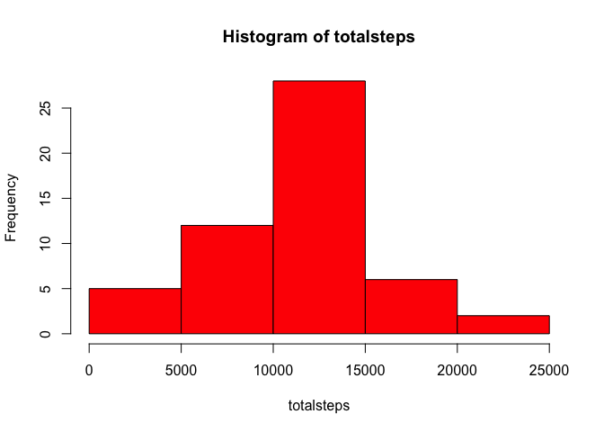
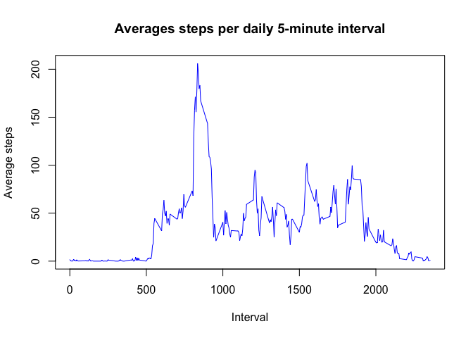
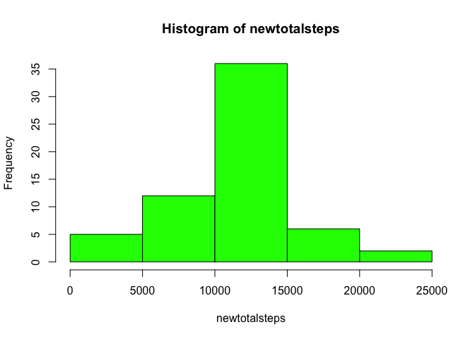
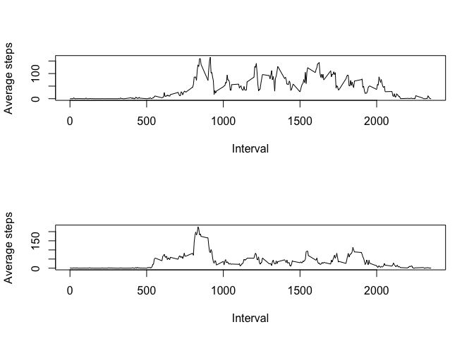

# Reproducible Research: Peer Assessment 1


## Loading and preprocessing the data

```r
myurl <- "https://d396qusza40orc.cloudfront.net/repdata%2Fdata%2Factivity.zip"
myfile <- "activity.zip"
download.file(myurl,myfile,"curl")
mycsv <- unzip(myfile)
mydf <- read.csv(mycsv)
# Don't use scientific notation for small numbers
options(scipen = 8, digits = 2)
```


## What is mean total number of steps taken per day?

```r
mydaily <- split(mydf[,1:2],mydf[,2])
# Since mydaily is now a list of steps per day, we use sapply to run sum() all steps per list item or day 
totalsteps <- sapply(1:length(mydaily),function(x) sum(mydaily[[x]][,1]))
hist(totalsteps, col = "red")
```

 

```r
tot_step_mean <- mean(totalsteps,na.rm = TRUE)
tot_step_median <- median(totalsteps,na.rm = TRUE)
```

The mean of total steps per day is : 10766.19 

The median of total steps per day is : 10765 

## What is the average daily activity pattern?

```r
# Here we split the dframe into intervals
mytinterval <- split(mydf[,1:3],mydf[,3])
# Now sapply mean() for each item in mytinterval holding one of the 288 daily intervals
averages <- sapply(1:length(mytinterval), function(x) mean(mytinterval[[x]][,1], na.rm = TRUE) )
names(averages) <- names(mytinterval)
plot(names(averages),averages,  xlab = "Interval", ylab = "Average steps", main = "Averages steps per daily 5-minute interval" , col = "blue" ,type ="l")
```

 

```r
# Now cycle through myinterval list and find the interval for which max(averages) belongs
for (i in 1:length(mytinterval)) {if (averages[i] == max(averages)) mymax <- names(averages)[i] }
```

The 5-minute interval containing the max average value of 206.17 is :    835


## Imputing missing values

```r
newdf <- data.frame(mydf)
mynumna <- sum(is.na(newdf[,1]))
for ( i in 1:nrow(newdf)) {
    myint <- newdf[i,3]
    if ( is.na(newdf[i,1])) {
            # We use averages value calculated earlier in "daily-activity" code chunk
            newdf[i,1] <- averages[as.character(myint)] 
        }
    }
newmydaily <- split(newdf[,1:2],newdf[,2])
newtotalsteps <- sapply(1:length(newmydaily),function(x) sum(newmydaily[[x]][,1]))
hist(newtotalsteps, col = "green")
```

 

```r
imp_mean <- mean(newtotalsteps,na.rm = TRUE)
imp_median <- median(newtotalsteps,na.rm = TRUE)
```

The mean of total steps per day for the imputed set is : 10766.19 

The median of total steps per day for the imputed set is : 10766.19 

The total number of missing values NA, is 2304 

## Are there differences in activity patterns between weekdays and weekends?

```r
library(data.table)
# Function to identify if our day string is a weekday or not
is.weekend <- function (a) { if ( a == "Saturday" | a == "Sunday" ) {"Weekend"} else {"Weekday"}}
newdt <- data.table(newdf)
# Now add two columns, one has the weekday, the next is logical for isweekend
shhh <- newdt[,weekday:=weekdays(as.Date(date))]
for ( i in 1:nrow(newdt)) {newdt[i,isweekend:=as.factor(is.weekend(newdt[i,weekday]))] }
# Process Weekend similarly to what we did in daily-activity chunk  
WEDT <- as.data.frame(newdt[isweekend=="Weekend",])
we.tinterval <- split(WEDT[,1:5],WEDT[,3])
we.averages <- sapply(1:length(we.tinterval), function(x) mean(we.tinterval[[x]][,1], na.rm = TRUE ))
names(we.averages) <- names(we.tinterval)
# Process Weekday similarly to what we did in daily-activity chunk  
WDDT <- as.data.frame(newdt[isweekend=="Weekday",])
wd.tinterval <- split(WDDT[,1:5],WDDT[,3])
wd.averages <- sapply(1:length(wd.tinterval), function(x) mean(wd.tinterval[[x]][,1],na.rm = TRUE))
names(wd.averages) <- names(wd.tinterval)
# Plot both WD/WE averages 
knitr::opts_chunk$set(fig.height=16)
par(mfrow = c(2,1))
plot(names(we.averages),we.averages,xlab = "Interval", ylab = "Average steps", type ="l", col = "blue")
plot(names(wd.averages),wd.averages,xlab = "Interval", ylab = "Average steps", type ="l", col = "blue")
```

 


