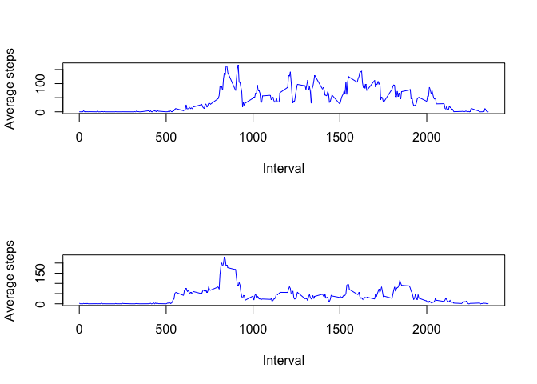

# Reproducible Research: Peer Assessment 1


## Loading and preprocessing the data

```r
myurl <- "https://d396qusza40orc.cloudfront.net/repdata%2Fdata%2Factivity.zip"
myfile <- "activity.zip"
download.file(myurl,myfile,"curl")
mycsv <- unzip(myfile)
mydf <- read.csv(mycsv)
```


## What is mean total number of steps taken per day?

```r
mydaily <- split(mydf[,1:2],mydf[,2])
totalsteps <- sapply(1:61,function(x) sum(mydaily[[x]][,1]))
hist(totalsteps)
```

 

```r
mean(totalsteps,na.rm = TRUE)
```

```
## [1] 10766.19
```

```r
median(totalsteps,na.rm = TRUE)
```

```
## [1] 10765
```

## What is the average daily activity pattern?

```r
mytinterval <- split(mydf[,1:3],mydf[,3])
averages <- sapply(1:288, function(x) {mysum <- sum(mytinterval[[x]][,1], na.rm = TRUE) ; mysum/length(mytinterval[[x]][,1])})
names(averages) <- names(mytinterval)
plot(names(averages),averages,  xlab = "Interval", ylab = "Average steps", type ="l")
```

 

```r
for (i in 1:288) {if (averages[i] == max(averages)) mymax <- names(averages)[i] }
```

The 5-minute interval containing the max average value of 179.1311475 is :    835


## Imputing missing values

```r
newdf <- data.frame(mydf)
mynumna <- sum(is.na(newdf[,1]))
for ( i in 1:nrow(newdf)) {
    myint <- newdf[i,3]
    if ( is.na(newdf[i,1])) {
            newdf[i,1] <- averages[as.character(myint)] 
        }
    }
newmydaily <- split(newdf[,1:2],newdf[,2])
newtotalsteps <- sapply(1:61,function(x) sum(newmydaily[[x]][,1]))
hist(newtotalsteps)
```

 

```r
mean(newtotalsteps,na.rm = TRUE)
```

```
## [1] 10581.01
```

```r
median(newtotalsteps,na.rm = TRUE)
```

```
## [1] 10395
```

The total number of missing values NA, is 2304 

## Are there differences in activity patterns between weekdays and weekends?

```r
library(data.table)
is.weekend <- function (a) { if ( a == "Saturday" | a == "Sunday" ) {"Weekend"} else {"Weekday"}}
newdt <- data.table(newdf)
# Now add two columns, one has the weekday, the next is logical for isweekend
shhh <- newdt[,weekday:=weekdays(as.Date(date))]
for ( i in 1:nrow(newdt)) {newdt[i,isweekend:=as.factor(is.weekend(newdt[i,weekday]))] }
# Weekend
WEDT <- as.data.frame(newdt[isweekend=="Weekend",])
we.tinterval <- split(WEDT[,1:5],WEDT[,3])
we.averages <- sapply(1:288, function(x) {mysum <- sum(we.tinterval[[x]][,1], na.rm = TRUE) ; mysum/length(we.tinterval[[x]][,1])})
names(we.averages) <- names(we.tinterval)
# Weekday
WDDT <- as.data.frame(newdt[isweekend=="Weekday",])
wd.tinterval <- split(WDDT[,1:5],WDDT[,3])
wd.averages <- sapply(1:288, function(x) {mysum <- sum(wd.tinterval[[x]][,1], na.rm = TRUE) ; mysum/length(wd.tinterval[[x]][,1])})
names(wd.averages) <- names(wd.tinterval)
# Plot
par(mfrow = c(2,1))
plot(names(we.averages),we.averages,xlab = "Interval", ylab = "Average steps", type ="l")
plot(names(wd.averages),wd.averages,xlab = "Interval", ylab = "Average steps", type ="l")
```

 


